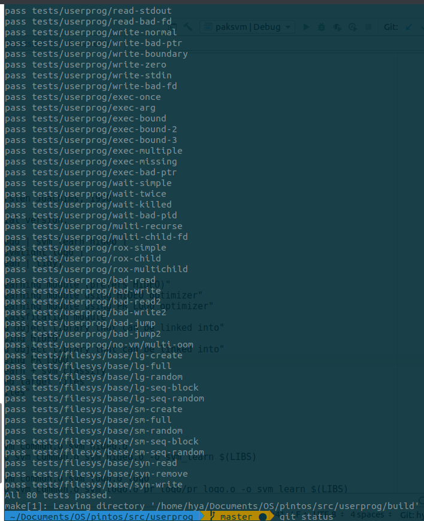

# OSProject2 User Programe
member: chengmin, huang Yu'an

### Before start:
1. change --qumu to --bocus,

2. process_wait() and system call write need to implement first, unless nothing output. (can use semaphore), now its busy waitting. It needs more smart implement later especially for syscall `wait()`. 

3. Can change compile optimized model to O0 for more convenient debug.

### Start:

Need to write system call hander for each system call.

must use argument -v -k -t 60

## Task 2

### data Structure:

add two structure **process** and **process_node**:

```c
*/
struct process
{
  /*father will wait in this semaphore, the address is given by its parent*/
  struct semaphore* be_wait;
  struct semaphore wait_anyone; // to implement wait(-1)
  /* to implement wait child load file completely, father need to wait child process loaded completely */
  struct semaphore wait_child_load;
    /* to implement child wait parent process_execute completely, child need to wait father process process_execute completely*/
  struct semaphore wait_father_execute;

  struct thread* father;
  
  struct list child;
  tid_t pid;
  bool is_loaded;  // indicate whether process load successfully, since execuable file may not found or have error

  struct file* this_file; // store the excutable file itself
  int rtv;             // return value of this thread(process).
};

```

```c
struct process_node
{
   /* father will wait in this semaphore, allocated by father and give the poiner to child */
  struct semaphore father_wait; 
  struct list_elem child_elem; // list elem for child list.
  tid_t pid;

  int rtv;  // return value of this thread(process).
};

```

add member in struct  `thread`:

```c

//==========add new struct to store process information============
    struct process proc;  // the process this thread belongs to
    struct process_node* node; // the node will be used by its father in its child list
```


### Algorithm

**syscall framework:**

use a array to store all system call's handle function with arguments `intr_frame* f`,  by looking 

`f->esp` can known the syscall number, then it can get the corresponding handle function.

```c
 int No = *(int *)(f->esp);
  if (No >= MAXCALL || No < 0)
  {
    process_exit_with_status(-1);
  }
  if (pfn[No] == NULL)
  {
    process_exit_with_status(-1);
  }
  f->eax = pfn[No](f); // put return value of syscall in f->eax, default return value is 0
```

use a function pop_stack() to get the arguments in stack pointer, each time we should check whether the get address is valid:

the invalid address has three case:

- null pointers,
- invalid pointers(which point to unmapped memory locations)
-  pointers to the kernel’s virtual address space. 

It may be the case that a 4-byte memory region (like a 32-bit integer) consists of 2 bytes of valid memory and 2 bytes of invalid memory, if the memory lies on a page boundary.

```c
bool is_valid_addr(const void *vaddr)
{
  if (!is_user_vaddr(vaddr) || pagedir_get_page(thread_current()->pagedir, vaddr) == NULL)
  {
    return false;
  }
  return true;
}

// get the arguments in esp and put it in address arg, also each time invoke it need to check if address is valid
void pop_stack(int *esp, int *arg, int offset)
{
  if (!is_valid_addr(esp + offset))
  {
      process_exit_with_status(-1);
  }
  else
  {
      *arg = *(esp + offset);
  }
}

```


**halt**:

just call `  shutdown_power_off();`

**exit**:

I have noted that the return value of process will put in struct `process`, it is done in `void process_exit_with_status(int status)`.

After we get the return value of  the process, we need to released all resource in `process_exit`, 

in function `process_exit`.

- load failure: the exit process may even load executable file fail, so I have a member `is_loaded` to indicate it which I have mentioned in data Structure part. When load fail, do not print exit code, and do not close the executable file `this_file`, and the return value of this process is 0 (default value).
- load success: we need to do all things I have mentioned in load failure case. And wait up parent process since he may be wait. I use semaphore to implement then. The semaphore `wait_ anyone` was used to case when parent called wait(-1). 

In both case above, we need to release all resource this process owned, including opened file, and released all child (make child's father be NULL, unless child may wait up their father by sema_up semaphore `&father->proc.wait_anyone` which may be dirty (father process has been destroyed).

```c
  // =========if load failuer, then didnt print exit code=======
    if(cur->proc.is_loaded){
        printf("%s: exit(%d)\n", cur->name,cur->proc.rtv);
        if(cur->proc.this_file!=NULL){
            file_allow_write(cur->proc.this_file);
            file_close(cur->proc.this_file);
        }
        cur->node->rtv = cur->proc.rtv;
    }
      //=======wait up waited father if any======= 
//noted that father may be finished, so access the reference is dangerous
      struct thread* father = cur->proc.father;
      if(father!=NULL && father->status != THREAD_DYING){
        sema_up( cur->proc.be_wait);
        sema_up( &father->proc.wait_anyone );
      }
      // noted that in there must do somthing to deallocate all resource, child_list, files owned etc.
      // !!! must make child's father pointer to NULL
      release_all_file( );
      release_mychild();

```

When process exit, it should copy its return value in `process_node->rtv`, otherwise there may have memory leakage when parent invoke wait to get child's return value; 

**exec**:

just get its expected return value and invoke `process_exit_with-status(rtv)`.

**wait**:

There have many case. This syscall is the most complicated one.

- when parent come to wait earlier:

  waited in children's semaphore

  - It is really this process's child: after waited child exit, remove this child in its child list. The return value was get by process_node which has the target `child_tid`. 
  - It not my child or have waited before: since wait will remove this child, so it can't not found this child in its child list

```c
// =======check if it is current process's child=========
  struct list_elem* child_elem =  find_mychild(child_tid);
  if( !is_child(child_tid) || child_elem==NULL ){
    return -1;
  }
  // =============get the wait child's samephore=======
  struct process_node *child_pro = list_entry(child_elem, struct process_node, child_elem);
  struct semaphore* to_wait = &child_pro->father_wait;

  sema_down(to_wait);

  //========remove this child in father's child list==========
  list_remove (&child_pro->child_elem);
  int return_code = child_pro->rtv;
  free(child_pro);
  
  return return_code;    
```

- when parent come to later than child call exit:
  - just read find child's process_node and get its return value (`child_pro_node->rtv`).

 

### Test

- syn-read: 
  
  - what does child-syn-read do?  problem: child finished first, so when father wait it it directly    
  
    return -1 immediately.
  
    find wait bug and fix it

